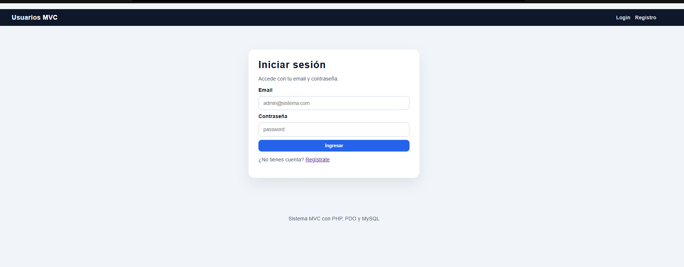
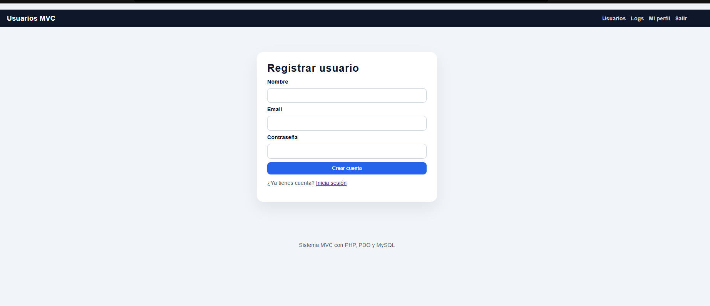
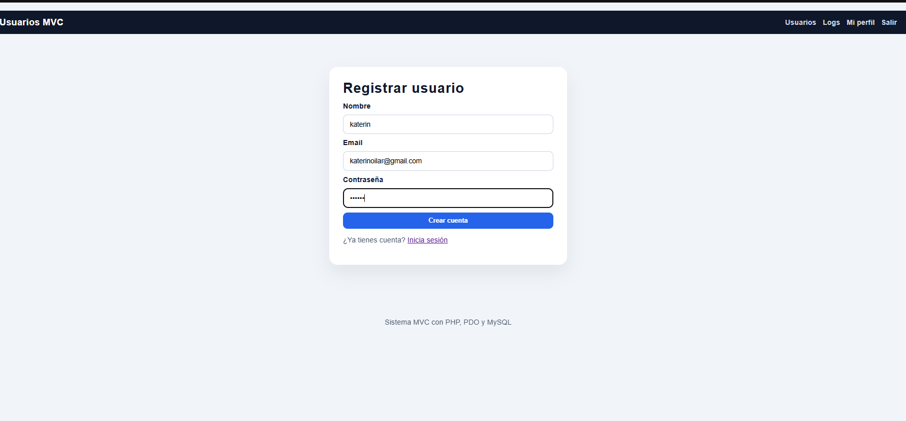
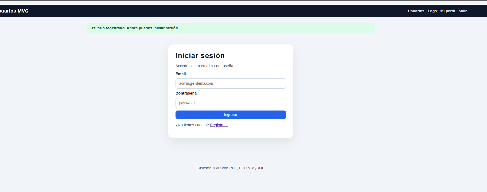
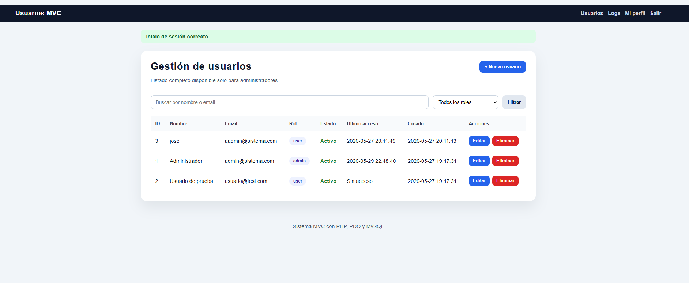
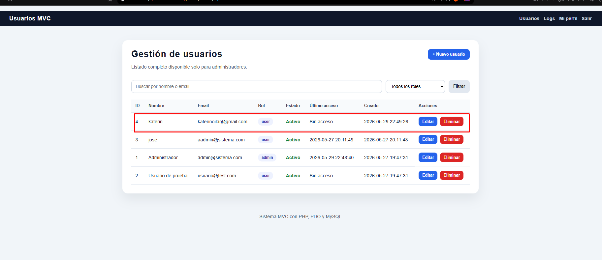
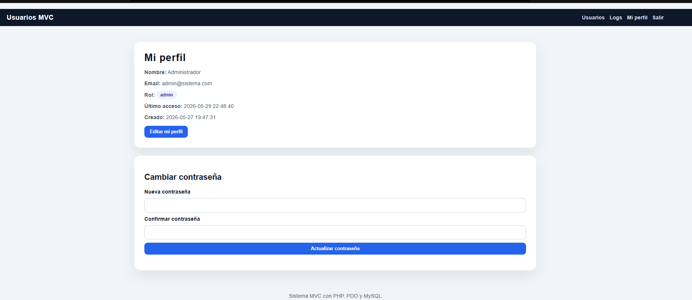
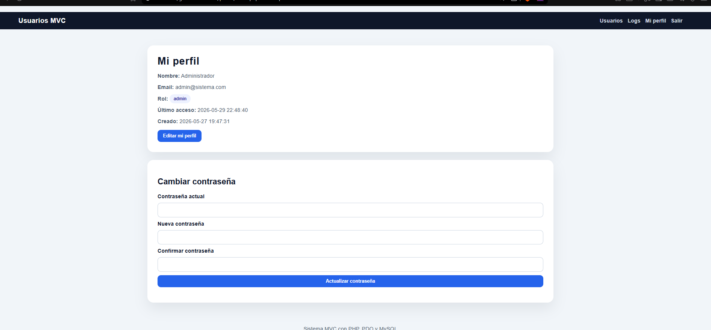
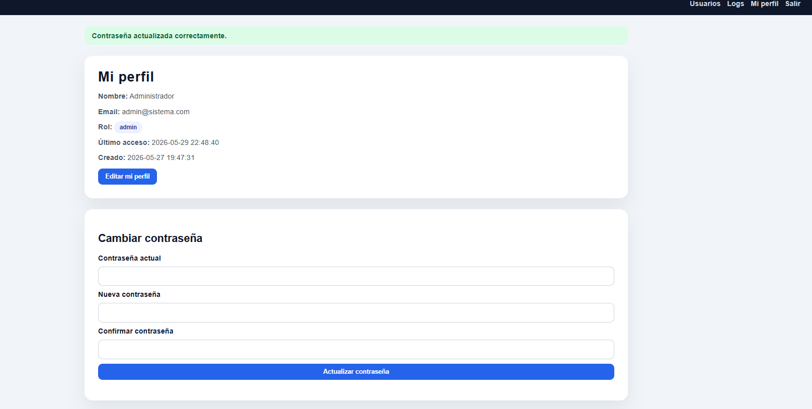
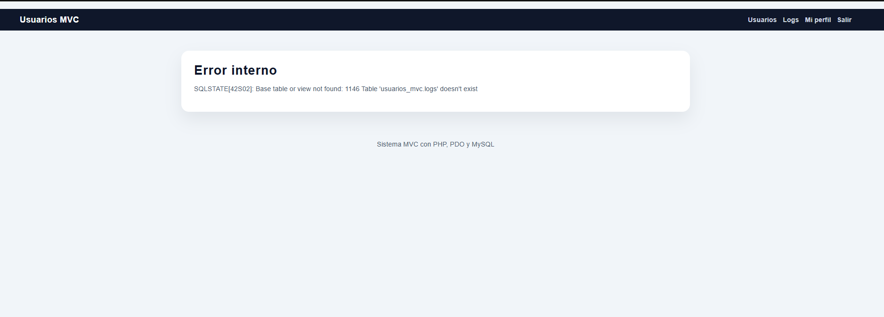

# Sistema de Gestion de Usuarios con Roles

Proyecto desarrollado en PHP con Programacion Orientada a Objetos, PDO, MySQL y patron MVC.

## Requisitos

- XAMPP, WAMP o servidor local equivalente
- PHP 8.0 o superior
- MySQL o MariaDB
- Extension `pdo_mysql` habilitada
- Navegador web

## Instalacion

1. Copia la carpeta `gestion-usuarios` dentro de `htdocs` si usas XAMPP.
2. Abre phpMyAdmin.
3. Importa el archivo:

```text
database/database.sql
```

4. Verifica la conexion en:

```text
config/Database.php
```

Configuracion por defecto:

```text
host: localhost
database: usuarios_mvc
usuario: root
contrasena: vacia
```

## Como abrir el proyecto

- URL principal:

```text
http://localhost/gestion-usuarios/public/
```

- URL directa de login:

```text
http://localhost/gestion-usuarios/public/index.php?action=login
```

- URL de logout:

```text
http://localhost/gestion-usuarios/public/index.php?action=logout
```

- URL de logs (solo admin):

```text
http://localhost/gestion-usuarios/public/index.php?action=logs
```

## Flujo de funcionamiento (paso a paso)

### 1) Pantalla de inicio de sesión


### 2) Ir al registro de usuario


### 3) Completar datos y crear cuenta


### 4) Confirmación de registro y retorno a login


### 5) Iniciar sesión como administrador


### 6) Ver nuevo usuario en el listado


### 7) Ir a Mi perfil


### 8) Cambiar contraseña (con contraseña actual)


### 9) Confirmación de contraseña actualizada


### 10) Nota sobre logs
Si no existe la tabla `logs`, puede aparecer este error al abrir `action=logs`.


## Verificacion rapida

Si ves error de conexion a base de datos:

1. Confirma que MySQL este encendido en XAMPP.
2. Revisa usuario y contrasena en `config/Database.php`.
3. Verifica que exista la base `usuarios_mvc`.

## Credenciales de prueba

- Admin: `admin@sistema.com` / `password`
- Usuario: `usuario@test.com` / `password`

## Caracteristicas

- Login con email y contrasena
- Logout
- Sesiones PHP
- Registro de usuarios
- CRUD de usuarios para administrador
- Edicion de perfil propio para usuario normal
- Cambio de contrasena
- Roles `admin` y `user`
- Actualizacion de ultimo acceso
- Registro de fecha de creacion y actualizacion
- Validacion de email unico
- Contrasenas protegidas con `password_hash()` y `password_verify()`
- Consultas seguras con prepared statements
- Salidas protegidas con `htmlspecialchars()`
- Filtros por nombre, email y rol en el listado de usuarios
- Diseno responsive con CSS
- Sistema de logs (bonus): login fallido, creacion/edicion/eliminacion de usuarios e IP de la peticion

## Estructura MVC

```text
gestion-usuarios/
|-- config/
|   `-- Database.php
|-- models/
|   |-- Usuario.php
|   `-- Auth.php
|   `-- Log.php
|-- controllers/
|   |-- UsuarioController.php
|   `-- AuthController.php
|-- views/
|   |-- layout/
|   |-- auth/
|   |-- logs/
|   `-- usuarios/
|-- middleware/
|   `-- AuthMiddleware.php
|-- public/
|   `-- index.php
|-- assets/
|   `-- css/
|       `-- style.css
|-- database/
|   `-- database.sql
|-- helpers.php
`-- README.md
```

## Nota

La eliminacion de usuarios se implemento como desactivacion logica, cambiando el campo `activo` a `0`.

## Bonus de logs

Este proyecto incluye una vista de logs para administradores en `action=logs`.

Eventos registrados:

- Intentos de login fallidos
- Login exitoso
- Creacion de usuarios
- Edicion de usuarios
- Eliminacion logica (desactivacion) de usuarios
- IP de cada peticion

Si tu base de datos ya existia antes de este cambio, ejecuta el bloque `CREATE TABLE logs ...` de `database/database.sql` para crear la tabla.
